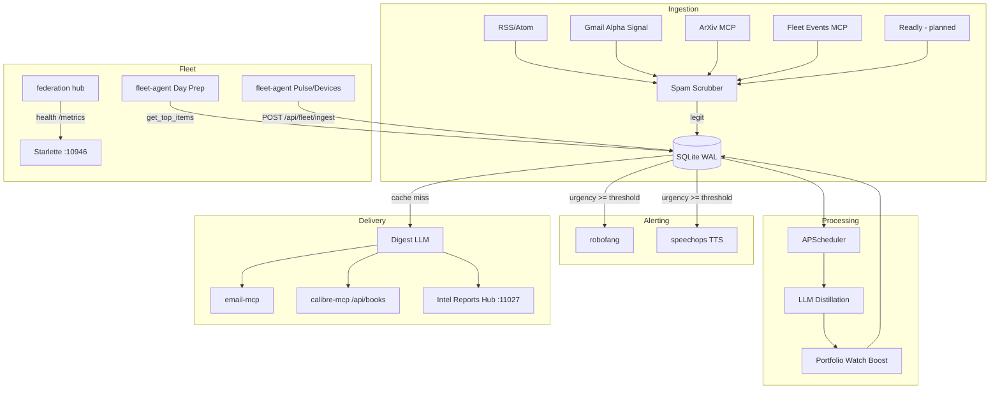

# aiwatcher-mcp Architecture

## High-Level Overview

`aiwatcher-mcp` is the fleet intelligence node: ingest → scrub → dedup → distill → alert → digest → archive. Fritz and the federation hub treat it as a first-class MCP on **10946**.

## Core Components

### Spam scrubber (`scrubber.py`)
Regex + URL blocklist at all ingest boundaries; hot-reload via `scrubber_reload`.

### Ingestion
- **RSS/Atom** — `feedparser`, parallel poll with semaphore.
- **Gmail** — newsletter link extraction via email-mcp REST.
- **ArXiv** — category latest via arxiv-mcp HTTP.
- **Fleet events** — `ingest_fleet_event` → synthetic `fleet` feed.

### Dedup
- **Cross-feed:** `_find_similar_item` compares title and combined title+summary (`difflib`, 85%, 48h).
- **GUID/URL:** unique constraints on insert.

### Distillation
Bundle-aware scoring (flash + pro tiers). **Portfolio watch** adds urgency boost and `portfolio-watch` tag when `PORTFOLIO_WATCH_TERMS` match.

**Digest generation** uses `get_cached_digest()` when `DIGEST_CACHE_TTL_MINUTES` > 0. Audience tones from `DIGEST_TONE_SANDRA` / `DIGEST_TONE_STEVE`.

### APScheduler jobs
| ID | Trigger |
|----|---------|
| `poll_feeds` | Interval |
| `distill` | Interval |
| `sync_interests` | 02:00 UTC |
| `retention` | 03:00 UTC |
| `alerts` | Cron (Vienna morning) |
| `daily_digest` | 06:00 UTC |

### Storage
- **SQLite** single pooled `aiosqlite` connection (`_get_pooled_connection`).
- **FTS5** on items for `search_items`.
- **Digests** table backs digest cache and history.

### Feed quality (`feed_quality.py`)
Per-feed 30-day average urgency → `quality_flag`: `healthy`, `low_signal`, or `insufficient_data`. Exposed on feed health API/MCP.

### Observability
- **`GET /metrics`** — Prometheus text gauges.
- **`GET /api/health`** — JSON contract for federation/Fritz.
- **`logging_utils.UIHandler`** — ring buffer for `/api/logs`.

### Fleet integration
- **robofang** — HTTP POST critical items.
- **speechops** — TTS wake-up.
- **fleet-agent** — `FLEET_SERVERS.aiwatcher`, Office Day Prep intel section.
- **mcp-federation-hub** — `federation-config.json` catalog entry.

### Web app
Vite/React on **10947**; `start.ps1` requires backend + frontend health before success.

## Database schema (summary)

- **`feeds`** — sources incl. `fleet` type for journal events.
- **`items`** — scores, `sent_email`, `sent_robofang`, `sent_calibre`, FTS.
- **`bundles`** / **`bundle_item_distillations`** — per-topic scoring.
- **`digests`** — HTML/text bodies + cache source.

## Security

- Env redaction on `/api/env`; remote env blocked without API key.
- Optional `AIWATCHER_API_KEY` on `/api/*`.
- Distillation prompts wrap untrusted feed content (`_SAFETY_WRAP`).
